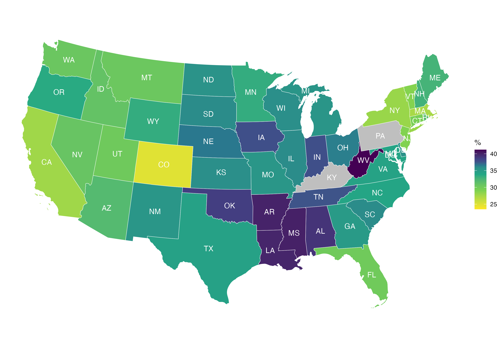
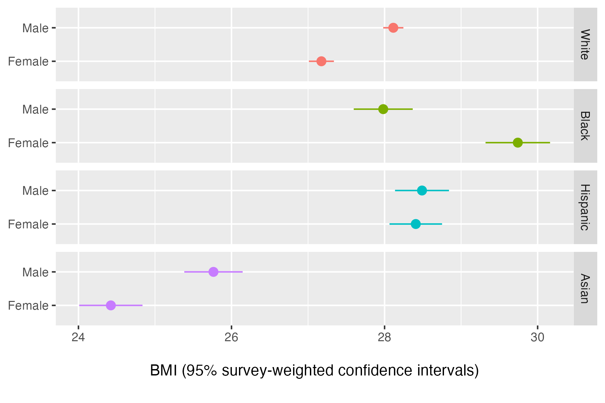

# Instructions

This exercise has a few pre-requisites:

1. You know how to set the __working directory__ properly in order for R to find the datasets used in the exercise. If not, revise the code and slides from previous tutorials.

2. You have already installed the [`tidyverse`][tidyverse] packages, as demonstrated in class multiple times, and you know how to install additional __packages__ if required to do so. If not, revise earlier course material.

3. You have completed Exercise 2 and are familiar with the [U.S. National Health Interview Survey][nhis] (NHIS), which we will use again here. The `docs` folder contains some of its documentation.

[nhis]: https://www.cdc.gov/nchs/nhis/index.htm
[tidyverse]: https://tidyverse.org/

__The  pre-requisites above will apply to all future exercises, as well as to graded work. Do not wait for the last minute to become familiar enough with R and RStudio for you to perform these steps routinely.__

## 1. Data preparation

Execute `01-data-preparation.r` in order to pre-process the data that will be used in the next scripts. Simply open the script, read the comments, and execute the lines as you go.

This will create a 'processed' dataset that will get saved in the `nhis2018.rds` file, which will itself be saved into the `data` folder. You will need that data to exist to complete the rest of the exercise.

## 2. Data visualization

Open `02-data-visualization.r` and do the following with it:

1. In Section 1, write some code to load the `nhis2018.rds` dataset into an object called `d`. The line of code has been started for you in the answers script.

    _Hint_ --- there is a function to do that in the `readr` package.

2. In Section 2, write some code to compute the prevalence of obesity ($\mathsf{BMI} \geq 30$) in the following groups:

  - Percentage of obese adults __by sex__ (e.g. among females)
  - Percentage of obese adults __by sex and race__ (e.g. among Hispanic females)

    _Hint_ --- prevalence rates are simply percentages. The `prop.table` and `table` functions should be useful here. If you do not know these functions, go back to Step 1 and do what I actually told you to do.
    
    __Question: what percentage of Black males are obese?__
    
3. In Section 3, write some code to produce some plots that look like the `bmi-boxplots.png` and `bmi-curves.png` plots that you will find in the `plots` folder.

    _Hint_ --- the plots were produced with [`ggplot2`][ggplot2], and both of them use [facets][faceting] through the [`facet_wrap`][facet_wrap] function.

    __Question: what unobserved variable might explain the difference observed among Asian respondents?__

[ggplot2]: https://ggplot2.tidyverse.org/
[facet_wrap]: https://ggplot2.tidyverse.org/reference/facet_wrap.html
[faceting]: https://ggplot2.tidyverse.org/articles/faq-faceting.html

4. __Optional__ -- as a bonus in Section 4, find a way to use the `plot`, `density` and `log` functions to draw two base R plots comparing BMI and its logarithmic transformation.

    _Hint_ --- `plot(density(x))`.

    __Question: do you find that taking the log of BMI improve its normality?__

## 3. Spatial visualization

__This entire section of the exercise is optional.__

The U.S. CDC website features many maps of [adult obesity prevalence][cdc]. Let's create our own: open `03-prevalence-rates.r`, execute the code, and towards the end, replace the parts that read '`...`' with the right object and variable names to reproduce the map saved under `obesity-prevalence.png` in the `plots` folder, which is also shown on the next page.

_Hint_ --- take a look inside the `geo` object to find the right variable names.

[cdc]: https://www.cdc.gov/obesity/data-and-statistics/adult-obesity-prevalence-maps.html

## 4. Survey-weighted estimates

__This entire section of the exercise is optional.__

So far, our code has used __unweighted__ estimates of obesity in the U.S. --- we have not applied survey weights, in order to keep things simple, and also because [survey weighting is a mess][gelman07] that even professional researchers struggle with.

[gelman07]: https://sites.stat.columbia.edu/gelman/research/published/STS226.pdf

As a result, the obesity prevalence estimates produced by our code will only approximately match the official, survey-weighted estimates published by public health agencies like the U.S. CDC. If we want to get closer to these figures, we need to use a more complex survey design.

To produce survey-weighted estimates, open `04-weighted-estimates.r`, execute the code, and towards the end, replace the parts that read '`...`' with the right object and variable names to reproduce the plot saved under `bmi-point-estimates.png` in the `plots` folder, which is also shown on the next page.

_Hint_ --- the hardest part will be modifying the code that uses the [`facet_grid`][facet_grid] function. The part of that line that reads `...` should be modified, but the later part that reads `~`&nbsp;`.` should actually stay that way.

[facet_grid]: https://ggplot2.tidyverse.org/reference/facet_grid.html

* * *

__N.B.__ The optional parts of this exercise are meant for students who already feel quite comfortable with R and with the syntax used by the [`ggplot2`][ggplot2] package. Give them a try if you like, but do not feel discouraged if you fail to complete them.

__You will be expected to have _some_ knowledge of how to draw plots with [`ggplot2`][ggplot2] for graded work, but you will _not_ be expected to draw complex plots such as maps or survey-weighted point estimates.__

We will come back to the topic of confidence intervals very soon.
